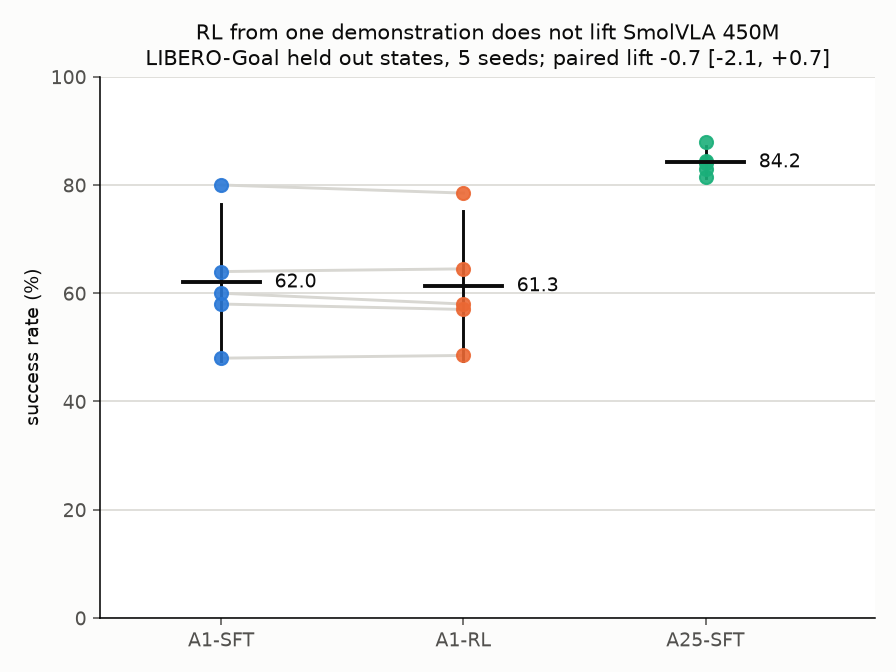

# SmolVLA-RL

**Does one demonstration plus reinforcement learning lift a 450M vision language action model the way it lifts a 7B one?**

## Summary

SimpleVLA-RL (Li et al., arXiv 2509.09674) reports that OpenVLA-OFT, a 7B vision language action model fine tuned on one trajectory per task, rises from 63.6 to 98.2 percent success on LIBERO-Goal after online RL (17.3 to 91.7 on LIBERO-Long; their Table 5). This repository tests the same starting condition at 450M: SmolVLA (Shukor et al., arXiv 2506.01844) fine tuned on one demonstration per task, which starts from a similar 62.0 percent on LIBERO-Goal, followed by online RL. Every run used a single RTX 5070 Ti (16 GB).

Under a preregistered budget of 1,600 RL episodes per seed (160 per task across 10 tasks), RL did not detectably change success: -0.70 points on held out initial states (95% CI [-2.13, +0.73], five seeds) and -0.31 points under perturbation on LIBERO-Plus (95% CI [-3.88, +3.27]). The data exclude a mean held out lift above about +1.4 points, far below the +34.6 SimpleVLA-RL reports on the same suite. A1-RL remains 22.9 points below supervised fine tuning on 25 demonstrations per task. The two setups differ in model family, RL algorithm and RL budget as well as scale, and this experiment does not isolate scale.

## Results

| | LIBERO-Goal, held out initial states | LIBERO-Plus, 196 perturbation variants |
| --- | --- | --- |
| A1-SFT, 1 demonstration per task | 62.0 | 30.7 |
| A1-RL, the same followed by RL | 61.3 | 30.4 |
| A25-SFT, 25 demonstrations per task | 84.2 | 46.1 |
| **A1-RL minus A1-SFT, paired by seed** | **-0.70 [-2.13, +0.73]** | **-0.31 [-3.88, +3.27]** |

Success rates in percent, five seeds per condition. Intervals are 95% t intervals with seeds as the unit of replication; each RL policy is compared with the SFT policy it started from, on the same 200 held out episodes or the same 196 variants. At the episode level, pooled over the 1,000 paired held out episodes, RL fixed 52 and broke 59 (lift -0.7, 95% paired interval about [-2.8, +1.4]).

The prediction registered before the runs, a paired lift above 5 points with A1-RL reaching 81.2 (the lower bound of A25-SFT's interval), is falsified on both counts.

## Checkpoints

| checkpoint | question | result | record |
| --- | --- | --- | --- |
| CP0 | How well does supervised fine tuning do from 1 and from 25 demonstrations per task? | 62.0 [47.5, 76.5] and 84.2 [81.2, 87.2]; the seed sd falls from 11.7 to 2.4 | [docs/cp0-cold-start.md](docs/cp0-cold-start.md) |
| CP1 | Can RL be applied correctly to a flow matching action expert? | exact per step likelihood, verified numerically; on one task, training success rises in two RL seeds from the same SFT checkpoint (pooled one sided permutation p ≤ 0.0005, the resolution of 2,000 permutations); deployment gains +5 and +4, not significant alone | [docs/cp1-rl-loop.md](docs/cp1-rl-loop.md) |
| CP2 | Does RL from one demonstration lift SmolVLA? | no detectable change: paired lift -0.70 [-2.13, +0.73], preregistered, five seeds | [docs/cp2-lift.md](docs/cp2-lift.md), [preregistration](docs/cp2-preregistration.md) |
| CP3 | Does anything change under perturbation? | no detectable change: -0.31 [-3.88, +3.27]; the demonstration gap persists (15.4 points against 22.2 in distribution; the difference between the two gaps is not resolved) | [docs/cp3-perturbation.md](docs/cp3-perturbation.md) |

## Interpretation and scope

What the result shows is that, at the preregistered budget, SmolVLA fine tuned on one demonstration per task does not reproduce the lift SimpleVLA-RL reports for OpenVLA-OFT from a similar starting success on the same suite. Scale is one of several differences between the two setups, and the experiment does not isolate it (SimpleVLA-RL details from their implementation section):

| | SimpleVLA-RL | this work |
| --- | --- | --- |
| model | OpenVLA-OFT on LLaMA2-7B, full parameter training | SmolVLA, 450M, frozen vision language backbone, 99.9M flow matching action expert trained |
| actions and exploration | discrete action tokens, parallel decoding, chunks of 8, sampled at temperature 1.6 | continuous actions from 10 denoising steps, chunks of 50 with 10 executed, Gaussian noise injected per step |
| algorithm | GRPO, groups of 8, clip 0.2 and 0.28, groups with all successes or all failures dropped, no KL, learning rate 5e-6 | policy gradient with a per (task, initial state) baseline, no KL, learning rate 2.5e-7 |
| rollouts per update | 64 x 8 = 512 (their stated batch and sampling count; total steps not reported) | 200 |
| rollouts per seed | not reported | 1,600 |
| hardware | 8 x A800 80 GB | 1 x RTX 5070 Ti 16 GB |

A single SimpleVLA-RL update uses about a third of this study's entire per seed budget.

**The same hyperparameters did not give the same effective update.** On task 4 alone (CP1), the recipe gave +5 and +4 points on training states in two seeds (neither significant alone) and a significant rise in training success. Across all 10 tasks, per update step KL was 3 to 10 times smaller (first updates 0.0013 to 0.0032 against 0.0088 and 0.0149), measured on the last round before each update. Each training state was visited 5 to 6 times against 32, so the per state baseline spent much of the run on its first visit fallback. The null is consistent with the policy moving too little at this budget, not only with an absence of signal.

**A weak training signal is present.** Pooled over seeds, training success rose by +0.26 points per 20 round block (one sided permutation p = 0.038), driven by seed 1 (p = 0.0055, which survives a Bonferroni correction over five seeds). That seed's gain did not transfer: on held out states it fixed 11 episodes and broke 14. Outcome changes of that size also occur without any policy change when only the evaluation draw changes (33 of 200, below), so they do not by themselves indicate learning.

## Methods

**Likelihood.** SmolVLA's action expert integrates a learned velocity field over 10 Euler steps. Each step is made a Gaussian transition, with standard deviation `a * sqrt(t / (1 - t)) * sqrt(dt)` (the t = 1 endpoint uses the next grid point) and a drift correction that preserves the ODE's marginals: the SDE form of Flow-GRPO (Liu et al., arXiv 2505.05470), ported from RLinf's flow SDE sampler (reported in πRL, Chen et al., arXiv 2510.25889). The chain log probability is then exact. Evaluation uses the original noise free sampler.

**Verification.** Before any result was trusted: closed form against Monte Carlo likelihood, zero expected score, importance ratio within 6.1e-5 of 1 before any update (tolerance 1e-3), zero parameter movement under constant reward, and training success rising on a task. Tolerances are in [docs/cp1-rl-loop.md](docs/cp1-rl-loop.md).

**Update.** A PPO clipped surrogate (clip 0.2) over the chain log probability. With one optimizer step per batch of fresh rollouts, the ratio stays within 2e-6 of 1 at every update and the clip never binds, so the update is effectively REINFORCE with a baseline. Advantage: reward minus the mean of the last 5 visits to the same (task, initial state), group mean on a first visit, not normalized. Gradients accumulated over 200 episodes per AdamW step (weight decay 0, gradient norm clip 1.0), no KL, entropy or value term. Joint noise at level 1.5 on all 10 denoising steps, learning rate 2.5e-7 declared from a step size measurement rather than swept, 8 updates. The 99.9M action expert parameters train in fp32.

**Protocol.** Preregistered before any CP2 run. RL trains on LIBERO initial states 20 to 49 and is evaluated on states 0 to 19. The SFT recipe, normalization statistics, evaluation seed and simulator stack are identical across conditions and across both evaluation distributions. CP3 was not preregistered.

## Implementation findings

| finding | evidence |
| --- | --- |
| lerobot reloads a trained expert in bf16, silently discarding most of an RL update | of 99.8M expert weights changed by an update, 10.5M survived a reload; fixed by loading at the stored dtype |
| Updates from 10 episodes are noise dominated | pairwise cosine between round gradients 0.00 ± 0.02; noise scale at least 200 episodes; runs differing only in RL seed landed up to 24 points apart under the first recipe |
| The initial state largely determines the outcome | 38 of one task's 50 initial states gave the same outcome on all 6 visits in a run where the policy barely moved (one noisy step at level 0.5), which motivated the per state baseline |
| The LIBERO-Plus fork corrupts the instruction of every non language variant | the first sweep scored 1.0 to 6.6 percent for all 7 policies evaluated; patched and verified over all 2,591 LIBERO-Goal variants |
| Evaluation is deterministic at a fixed configuration, but one draw is one sample | three runs agree on all 200 episodes; changing only the episode count changes 33 of them, and seed 1's held out lift from -1.5 to +2.5 |
| Host memory, not GPU memory, binds on one card | peak allocated VRAM 3.3 GiB per training round, 5.4 GiB in the joint noise probe; each LIBERO simulator process holds about 2 GB |

## Limitations

- One suite, one model size, one learning rate, one RL budget.
- Held out evaluation uses 20 episodes per task on initial states 0 to 19, not LIBERO's customary 50.
- The update recipe (baseline, sampler, learning rate) was chosen on one task, A1 seed 0 task 4, whose initial states include the held out 0 to 19. This would favour a positive result, not the null.
- LIBERO-Plus is a 196 variant stratified sample with one episode per variant, because each variant stores a single initial state. SFT and RL policies were evaluated at different code versions of the development repository and at different speeds (9 to 12 against 19 to 21 s per variant, undiagnosed); the LIBERO-Plus harness was not tested for repeatability.
- The Language category is at 0.7 to 2.1 percent for every policy and weighs one seventh of the LIBERO-Plus aggregate. The paraphrases were checked at the fork's instruction builder but, unlike the other categories' instructions, were not inspected as the policy receives them.
- Intervals use seeds as the unit; the benchmark diagnostics released with arXiv 2606.04233 were not applied.
- Published LIBERO-Plus baselines were not audited for the instruction defect found here.
- Checkpoints are not released; rerunning evaluations or `scripts/weight_cosine.py` requires retraining.

## Reproduction

WSL2 Ubuntu 24.04, Python 3.12, one CUDA GPU with 16 GB, and about 25 GB of host memory for RL.

    uv venv ~/venvs/vla --python 3.12
    uv pip install --python ~/venvs/vla torch torchvision --index-url https://download.pytorch.org/whl/cu128
    uv pip install --python ~/venvs/vla -e .
    export MUJOCO_GL=egl LP_NUM_THREADS=1
    bash scripts/check_stacks.sh

System packages: cmake build-essential libegl1 libgl1 libegl-dev libgl-dev libosmesa6. LIBERO-Plus runs in a separate environment built by `scripts/setup_libero_plus.sh`.

The simulator version changes contacts, so match it exactly. The runs used torch 2.11.0 (CUDA 12.8), lerobot 0.6.1, hf-libero 0.1.4, robosuite 1.4.0, MuJoCo 3.8.1, numpy 2.2.6 and transformers 5.5.4, identical in both environments except the LIBERO package itself (hf-libero 0.1.4 in distribution, the LIBERO-Plus fork for perturbation); `uv.lock` records the resolved set and `scripts/check_stacks.sh` prints both environments side by side. Base model `lerobot/smolvla_base` @ `d9f33c94a60fb382c90dea2164c96845bd955e28`, dataset `lerobot/libero` @ `a1aaacb7f6cd6ee5fb43120f673cebb0cfea7dd4`.

Each checkpoint record ends with the commands that regenerate its runs and statistics. Every figure regenerates from `logs/` with `python scripts/make_figures.py`. CP2 took 26.7 hours of GPU wall clock for five seeds.

| path | contents |
| --- | --- |
| `configs/` | shared recipe, per condition deltas, demonstration subsets, the LIBERO-Plus sample |
| `src/smolvla_rl/` | supervised fine tuning, the RL loop and its verification, evaluation |
| `scripts/` | launchers, analyses, figure generation |
| `logs/` | raw per episode and per update results, append only |
| `figures/` | every figure, regenerated from `logs/` |
| `docs/` | one record per checkpoint, and the preregistration |

## References

- Li et al. SimpleVLA-RL: Scaling VLA Training via Reinforcement Learning. arXiv 2509.09674.
- Shukor et al. SmolVLA: A Vision-Language-Action Model for Affordable and Efficient Robotics. arXiv 2506.01844.
- Liu et al. Flow-GRPO: Training Flow Matching Models via Online RL. arXiv 2505.05470.
- Chen et al. πRL: Online RL Fine-tuning for Flow-based Vision-Language-Action Models. arXiv 2510.25889. RLinf, github.com/RLinf/RLinf.
- Zhang et al. ReinFlow: Fine-tuning Flow Matching Policy with Online Reinforcement Learning. arXiv 2505.22094.
- Liu et al., 2023. LIBERO: Benchmarking Knowledge Transfer for Lifelong Robot Learning. arXiv 2306.03310.
- Fei et al. LIBERO-Plus: In-depth Robustness Analysis of Vision-Language-Action Models. arXiv 2510.13626. Fork github.com/sylvestf/LIBERO-plus.
- Jiang et al. What Are We Actually Benchmarking in Robot Manipulation? arXiv 2606.04233.
- LeRobot, github.com/huggingface/lerobot, version 0.6.1.
