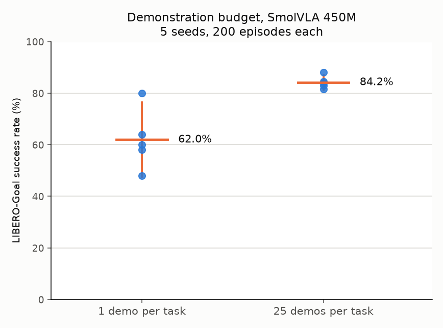
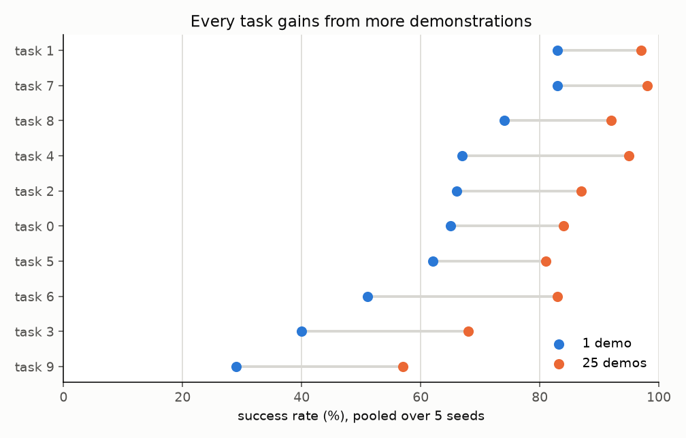

# CP0: demonstration efficiency of SmolVLA on LIBERO-Goal

Supervised fine tuning of SmolVLA (450M) at two demonstration budgets, 1 and 25 per task, five seeds each. These policies are the starting points for the RL experiments that follow.

## Setup

| setting | value |
| --- | --- |
| base model | `lerobot/smolvla_base` @ `d9f33c94a60fb382c90dea2164c96845bd955e28` |
| dataset | `lerobot/libero` @ `a1aaacb7f6cd6ee5fb43120f673cebb0cfea7dd4`, LIBERO-Goal (`libero_goal`, 10 tasks, max 300 steps) |
| trained parameters | action expert only, vision encoder frozen (SmolVLA's shipped recipe) |
| optimizer | lr 1e-4, 1,000 warmup steps, cosine decay horizon 30,000 steps to 2.5e-6, pinned in `configs/base.yaml` |
| training | 8,000 steps at batch 32 |
| demonstration subsets | per seed and budget in `configs/subsets/libero_goal.json`; each seed draws its own demonstrations, nested so the 1 demonstration set lies inside the 25 demonstration set; normalization statistics come from the full dataset's `stats.json`, and the saved normalizer is byte identical across all ten checkpoints |
| evaluation | 20 episodes per task on initial states 0 to 19, 200 per policy, `n_action_steps` 10, eval seed 1000 |
| simulator | robosuite 1.4.0, MuJoCo 3.8.1, hf-libero 0.1.4, rendered on CPU (Mesa llvmpipe, `MUJOCO_GL=egl`, `LP_NUM_THREADS=1`) |
| software | lerobot 0.6.1, torch 2.11 (CUDA 12.8), Python 3.12 |

## Design decisions

**Suite.** LIBERO-Goal keeps objects and layout fixed across its 10 tasks, so the image does not identify the task; the instruction does. The suite choice therefore makes the language channel necessary rather than optional.

**Action steps.** 10 executed actions per predicted chunk. The SmolVLA paper (arXiv 2506.01844, Table 13) reports LIBERO-Goal at 85, 91, 74 and 58 for 1, 10, 30 and 50 executed actions; 10 matches the best of these and needs ten times fewer policy calls than 1. This differs from the paper's main protocol, which replans every step.

**Step count.** A pilot at batch 32 (100 episodes per point) found no gain from longer training within one learning rate schedule: 68 at 8,000 steps and 69 at 16,000 for one demonstration per task. lerobot rescales its schedule to the configured total steps, so the schedule values are pinned rather than left to that default.

**Rendering.** On WSL2, GPU rendering through D3D12 is latency bound and does not scale across processes (100 frames per second over 20 processes, against 260 for CPU rendering at one thread per process in a probe scene). CPU rendering also leaves the GPU to the policy.

## Results

| condition | per seed | mean | sd | 95% t interval |
| --- | --- | --- | --- | --- |
| A1-SFT, 1 demonstration per task | 64, 80, 60, 58, 48 | 62.0 | 11.7 | [47.5, 76.5] |
| A25-SFT, 25 demonstrations per task | 88, 81.5, 84.5, 83, 84 | 84.2 | 2.4 | [81.2, 87.2] |

The gap is 22.2 points (Welch t = 4.17, df = 4.3, p = 0.012, seeds as the unit of replication).

**Seed variance collapses with budget.** The between seed standard deviation falls from 11.7 at one demonstration to 2.4 at 25. With a single demonstration, which demonstration is drawn matters nearly as much as the method: seed 4 reached 5 percent on task 0 and 25 percent on task 1, where other seeds reached 90 to 100.

Every task gains from more demonstrations, by 14 to 32 points.

**Context.** OpenVLA-OFT (7B) scores 63.6 on LIBERO-Goal after supervised fine tuning on one trajectory per task (SimpleVLA-RL, arXiv 2509.09674, Table 5). At the supervised starting line, SmolVLA at 450M is not behind.

## Reproducing

    bash scripts/run_cp0.sh
    python scripts/make_figures.py

`run_cp0.sh` trains and evaluates each condition and seed, appending one row per episode to `logs/episodes.csv`; `make_figures.py` regenerates both figures from that file. The `git_sha` column in the logs refers to the development repository in which the runs were made.
