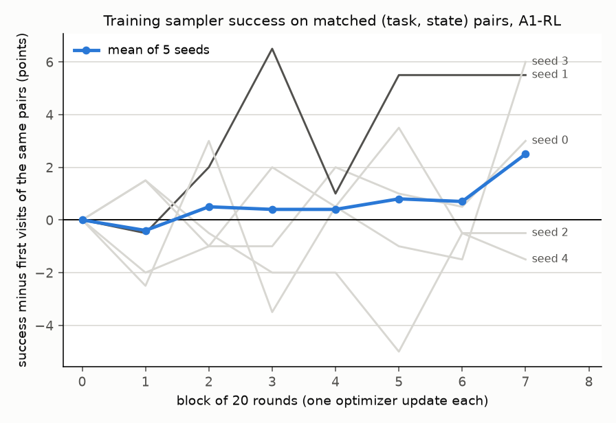

# CP2: does RL from one demonstration lift SmolVLA?

RL from each A1-SFT seed on all 10 LIBERO-Goal tasks under the frozen recipe of [the preregistration](cp2-preregistration.md), five seeds, evaluated on held out initial states. No run failed and the stop rule never fired.

## Primary result

| seed | A1-SFT | A1-RL | lift | fixed | broke | exact McNemar |
| --- | --- | --- | --- | --- | --- | --- |
| 0 | 64.0 | 64.5 | +0.5 | 9 | 8 | 1.000 |
| 1 | 80.0 | 78.5 | -1.5 | 11 | 14 | 0.690 |
| 2 | 60.0 | 58.0 | -2.0 | 13 | 17 | 0.585 |
| 3 | 58.0 | 57.0 | -1.0 | 10 | 12 | 0.832 |
| 4 | 48.0 | 48.5 | +0.5 | 9 | 8 | 1.000 |

Paired lift: mean -0.70, sd 1.15, 95% t interval (df 4) [-2.13, +0.73]. A1-RL seed mean 61.30, sd 11.17, interval [47.43, 75.17].

Pooled episodes, Clopper-Pearson 95%: A1-RL 613/1000 = 61.3 [58.20, 64.33]; A1-SFT 620/1000 = 62.0 [58.91, 65.02]; A25-SFT 842/1000 = 84.2 [81.79, 86.41].

## Preregistered outcomes

| rule | outcome |
| --- | --- |
| prediction (a), paired lift above 5 | **falsified**: the interval lies entirely at or below 5 |
| prediction (b), A1-RL seed mean at or above 81.2 | **falsified**: the interval's upper bound, 75.17, is below 81.2 |
| decision rule | gap A25-SFT minus A1-RL = 22.90, above 20: decisive, with 1,000 eval episodes per condition |
| seed escalation | fired after seeds 0 and 1 (lift interval [-13.21, +12.21] included 0), so seeds 2 to 4 were run |
| interpretation rule (every pair's weight change cosine below 0.01 means noise dominated) | not triggered: 2 of 10 pairs exceed 0.01 |

**The interpretation rule is uninformative here.** The 10 pairwise cosines of expert weight change range from -0.027 to +0.0135 and average -0.0046, consistent with no shared direction across seeds. But each seed starts from a different SFT checkpoint trained on different demonstrations, so a low cosine is equally consistent with noise and with each model being moved in its own direction. The rule did not account for this; on task 4, where the two seeds shared a starting checkpoint, the cosine was 0.176.

## Exploratory analyses, not preregistered

**Training success over the run.** Slope of training success over 20 round blocks, permutation within (seed, task, initial state), 2,000 permutations, one sided:

| seed | 0 | 1 | 2 | 3 | 4 | pooled |
| --- | --- | --- | --- | --- | --- | --- |
| slope, points per block | +0.40 | +0.91 | -0.30 | +0.32 | -0.03 | +0.26 |
| p | 0.146 | 0.0055 | 0.705 | 0.187 | 0.408 | 0.038 |

Only seed 1 improved its training states detectably under the training sampler (it survives a Bonferroni correction over five seeds), and its held out lift was -1.5.

**Seed 1 on its training states under the deployment sampler.** A1-SFT seed 1 and A1-RL seed 1 evaluated on all 50 initial states (`--episodes 50`):

| states | n | A1-SFT | A1-RL | fixed | broke | exact McNemar |
| --- | --- | --- | --- | --- | --- | --- |
| 20 to 49, training | 300 | 240 | 244 | 19 | 15 | 0.608 |
| 0 to 19, held out | 200 | 157 | 162 | 13 | 8 | 0.383 |

No detectable gain on training states either. The training sampler gain of seed 1 does not appear under the noise free sampler at a size 300 episodes can detect.

**Evaluation is deterministic at a fixed configuration.** Three runs of A1-SFT seed 1's primary evaluation (20 episodes per task) agree on all 200 episodes. The 50 episode run above differs from them on 33 of the first 200 episodes, so outcomes depend on the random draw that the episode count determines (inferred, not traced to the code). Consequences: the per seed differences in the primary table are behaviour changes measured on one fixed draw, but one draw is one sample: RL seed 1 changed its outcome on 25 held out episodes in the primary draw, netting to about zero, and its held out lift is -1.5 on that draw and +2.5 on the 50 episode draw. Outcome changes of this size occur without any policy change when only the draw changes (33 of 200).

## Considered and not run

- **A 5 demonstration rung.** A1 is not at a signal floor: before any update, A1 success on its training states was 48.5 to 69 percent across seeds 0 to 3, near the 50 percent where binary reward carries the most information, and RL did move an A1 policy on task 4 with ten times the per task episodes.
- **Extending training beyond 160 rounds.** The four seed interval then available bounded the held out lift at +0.72, so even doubling the largest effect the data allowed would not approach the predicted +5, and for seeds 0 and 1 the cumulative weight change grew by less in each successive 40 rounds (norm 0.0038, 0.0057, 0.0071, 0.0083 at rounds 40 to 160, increments 0.0038, 0.0019, 0.0014, 0.0012).

## What this answers

At 450M, from one demonstration per task, sparse reward RL with 1,600 episodes per seed across the 10 LIBERO-Goal tasks (160 per task) did not change held out success: -0.70 points, 95% interval [-2.13, +0.73]. It does not show that no RL budget lifts a 450M model; on task 4 alone, ten times the per task episodes moved the policy measurably (CP1).

## Reproducing

    SEEDS="0 1 2 3 4" bash scripts/run_cp2.sh
    python scripts/cp2_analysis.py
    python scripts/stop_rule.py a1_rl_s0
    python scripts/weight_cosine.py
    python scripts/cp2_training_trend.py
    python scripts/diag_train_states.py
    python scripts/eval_repeatability.py
    python scripts/make_figures.py

`weight_cosine.py` needs the checkpoints under `outputs/`; every other script reads `logs/` only. CP2 took 26.7 GPU hours for five seeds on one RTX 5070 Ti.
