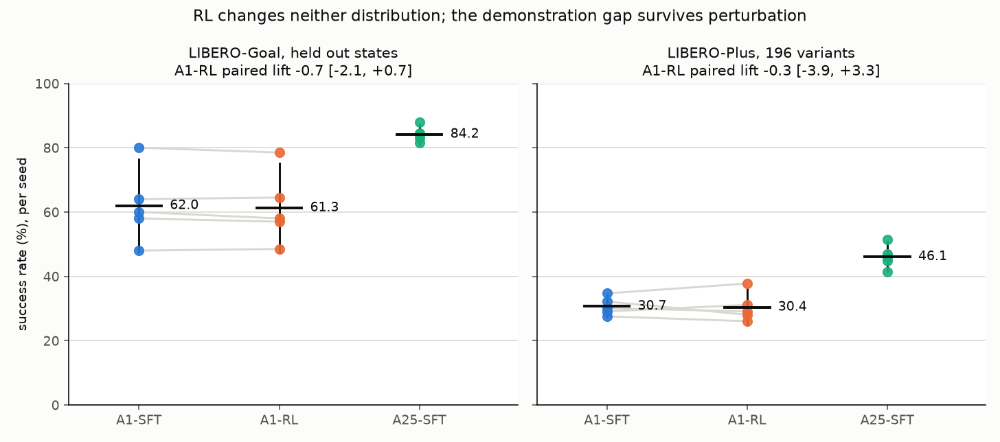
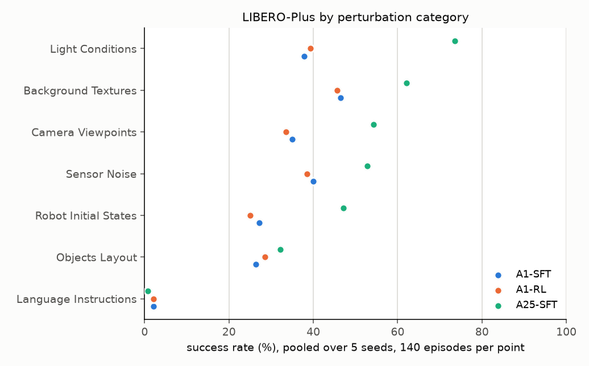

# CP3: robustness under perturbation

Every SFT and RL policy evaluated on LIBERO-Plus (arXiv 2510.13626), which perturbs camera viewpoint, robot initial state, language, lighting, background, sensor noise and object layout. Standard LIBERO success is known to overstate what a policy has learned (arXiv 2606.04233), so an RL gain reported on standard LIBERO alone would be hard to interpret. CP2 found no in distribution gain; this checkpoint asks whether anything changed under perturbation, and measures how much of the demonstration gap survives it.

## Setup

| setting | value |
| --- | --- |
| benchmark | LIBERO-Plus fork (github.com/sylvestf/LIBERO-plus) @ `4976dc3`, LIBERO-Goal variants, patched as below |
| sample | 196 variants stratified over the 7 categories, 28 each (`configs/libero_plus_sample.json`, `src/smolvla_rl/eval/sample_perturbations.py`) |
| episodes | one per variant: LIBERO-Plus stores a single initial state per variant, so a second episode would only resample policy randomness |
| simulator | robosuite 1.4.0, MuJoCo 3.8.1, identical to the in distribution evaluation (`scripts/check_stacks.sh` prints both environments) |
| policies | A1-SFT and A25-SFT (CP0) and A1-RL (CP2), five seeds each; RL checkpoints loaded at their stored dtype |
| execution | 5 independent processes, each evaluating a fixed shard of the sample; the same sample and shard layout for every policy |

## Two defects found before any result was trusted

**The fork corrupts the instruction of every non language variant.** It builds each variant's instruction from its file name, so the policy was told, for example, "put the bowl on the stove view 26 0 100 0 0 initstate 0". On LIBERO-Goal, where all ten tasks share one scene, the instruction is the only signal of which task to perform. The first sweep scored 1.0 to 6.6 percent for every policy with a nearly flat category profile; that sweep is void and kept only as a record (`logs/episodes_plus_void_instruction_bug.csv`). `scripts/patch_libero_plus.py` cuts the file name at the first perturbation marker for non language variants. Run over the whole suite, the patched function gives all 2,181 non language variants exactly their base task's instruction, and the 410 language variants keep their paraphrase, which is the perturbation that category measures. `src/smolvla_rl/eval/probe_envs.py` fails any non language variant whose instruction contains a digit.

Published LIBERO-Plus baselines come from each model's own evaluation code, which was not audited here for the same defect.

**The first environment used a different simulator.** The LIBERO-Plus environment had been built with robosuite 1.4.1 and MuJoCo 3.7.0 against the 1.4.0 and 3.8.1 used in distribution. robosuite 1.4.1 adds a collision geometry to the Panda's seventh link and sets `autolimits="true"` on the model compiler, which changes how every `range` attribute is interpreted, so the same action can produce different contacts. The fork itself pins robosuite 1.4.0; the environment was rebuilt to match the in distribution stack exactly.

The two fixes landed together. On the 28 Background variants, A25-SFT seed 0 went from 3 of 28 before them to 24 of 28 after (86 percent, against 88.0 in distribution), so together they restore a working harness; which one mattered more was not separated.

Two further patches keep the fork running under NumPy 2: fog used the removed `np.float_` and a 256 pixel fractal that cannot cover a 360 by 360 render (now generated at the next power of two and cropped, identical to upstream at 256 and below), and motion blur used the removed binary `np.fromstring`.

## Results

| condition | LIBERO-Goal, held out | LIBERO-Plus, seed mean and 95% t interval |
| --- | --- | --- |
| A1-SFT | 62.0 | 30.7 [27.3, 34.2] |
| A25-SFT | 84.2 | 46.1 [41.5, 50.7] |
| A1-RL | 61.3 | 30.4 [24.8, 36.0] |
| **A1-RL gain over A1-SFT, paired by seed** | **-0.70 [-2.13, +0.73]** | **-0.31 [-3.88, +3.27]** |

A1-RL against A1-SFT, paired by variant:

| seed | A1-SFT | A1-RL | lift | fixed | broke | exact McNemar |
| --- | --- | --- | --- | --- | --- | --- |
| 0 | 27.6 | 26.0 | -1.5 | 5 | 8 | 0.581 |
| 1 | 34.7 | 37.8 | +3.1 | 10 | 4 | 0.180 |
| 2 | 30.1 | 29.1 | -1.0 | 7 | 9 | 0.804 |
| 3 | 29.1 | 31.1 | +2.0 | 10 | 6 | 0.454 |
| 4 | 32.1 | 28.1 | -4.1 | 6 | 14 | 0.115 |

| category | A1-SFT | A1-RL | lift | A25-SFT |
| --- | --- | --- | --- | --- |
| Background Textures | 46.4 | 45.7 | -0.7 | 62.1 |
| Camera Viewpoints | 35.0 | 33.6 | -1.4 | 54.3 |
| Language Instructions | 2.1 | 2.1 | +0.0 | 0.7 |
| Light Conditions | 37.9 | 39.3 | +1.4 | 73.6 |
| Objects Layout | 26.4 | 28.6 | +2.1 | 32.1 |
| Robot Initial States | 27.1 | 25.0 | -2.1 | 47.1 |
| Sensor Noise | 40.0 | 38.6 | -1.4 | 52.9 |

Pooled over seeds, 140 episodes per cell.

## Reading

1. **RL changed neither distribution.** Both gains have intervals spanning zero, and A1-RL's category profile tracks A1-SFT's within 2.1 points in every category.
2. **The demonstration gap survives perturbation, smaller.** A25-SFT leads A1-SFT by 22.2 points in distribution and 15.4 on LIBERO-Plus. RL closes neither.
3. **Language paraphrase collapses every policy** (0.7 to 2.1 percent). The other categories spread from 25 to 74 percent, so this is a property of the policies, not a broken harness: published models also collapse in single categories, and none has a flat profile (LIBERO-Plus fork README; `scripts/cp3_diagnose.py` compares).
4. Whether this sharded, one episode per variant evaluation is deterministic was not tested.

## Reproducing

    bash scripts/setup_libero_plus.sh
    bash scripts/check_stacks.sh
    bash scripts/probe_cp3.sh
    bash scripts/run_cp3.sh
    CONDITIONS=a1_rl STEPS=160 STAGE=rl BUDGET=1 EVAL_ARGS=--stored-dtype CHECKPOINT='outputs/rl/{condition}_s{seed}/round_160' bash scripts/run_cp3.sh
    python scripts/cp3_analysis.py
    python scripts/make_figures.py

The first `run_cp3.sh` evaluates the SFT policies with its defaults; the second evaluates the RL policies. With five processes the RL policies ran at 19 to 21 s per variant, about an hour each, on one RTX 5070 Ti; the SFT policies, evaluated earlier, ran at 9 to 12 s per variant. The slowdown was not diagnosed.
